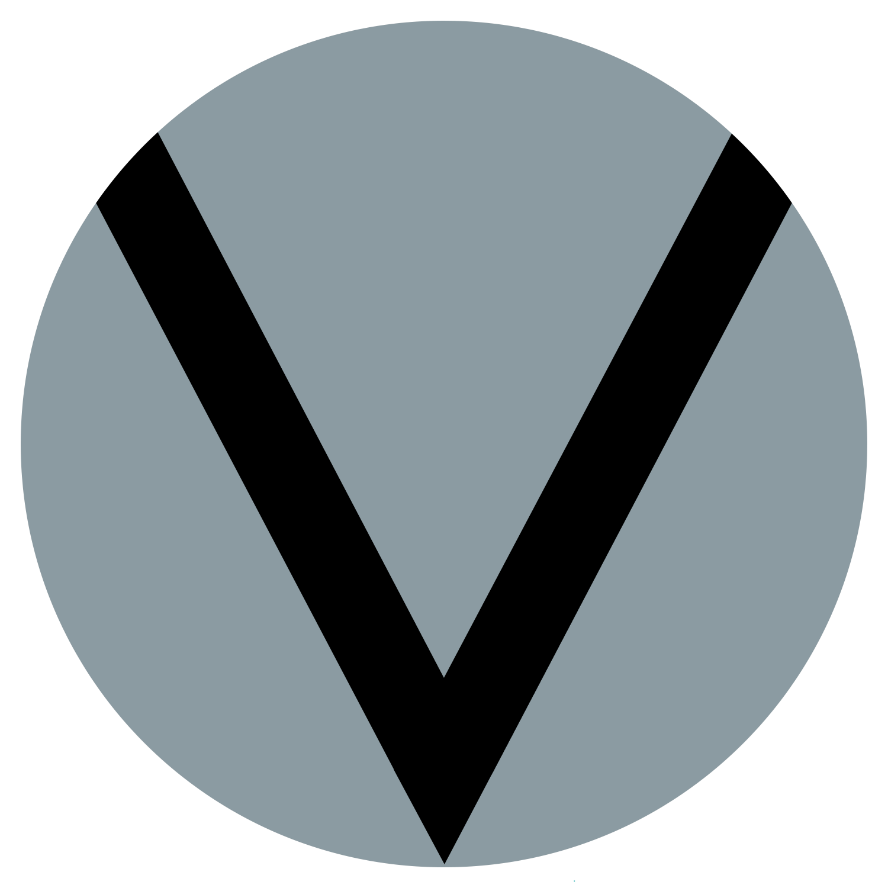

	
	 
	<h1>L V N Λ C Y Obsidian</h1>
	This org serves as a general repository for custom 
	<a href='https://obsidian.md'>
		Obsidian
	</a>
	 tooling, including themes in development, CSS snippets, reference guides, 
	and other such resources. If it has been shipped, it is most likely 
	included in the 
	<a href='https://github.com/lvnacy-obsidian/obsidian-vault-template'>
		Obsidian Vault Template
	</a>
	. Please refer to the READMEs of each repository for detailed information 
	on the tooling.

